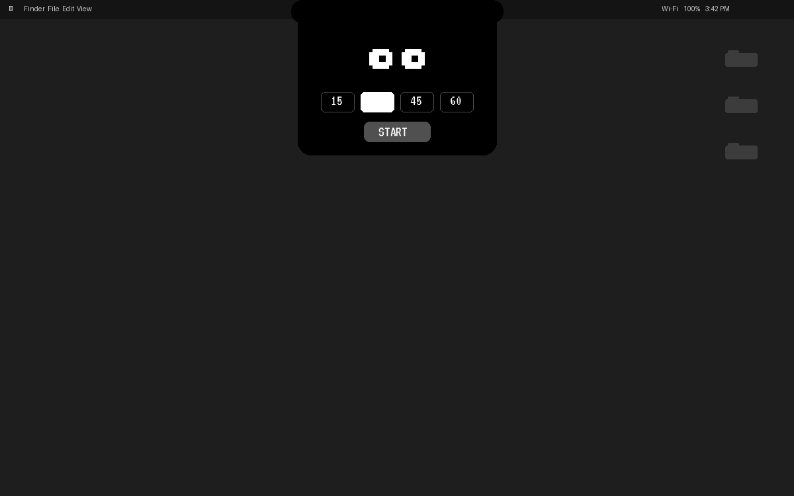
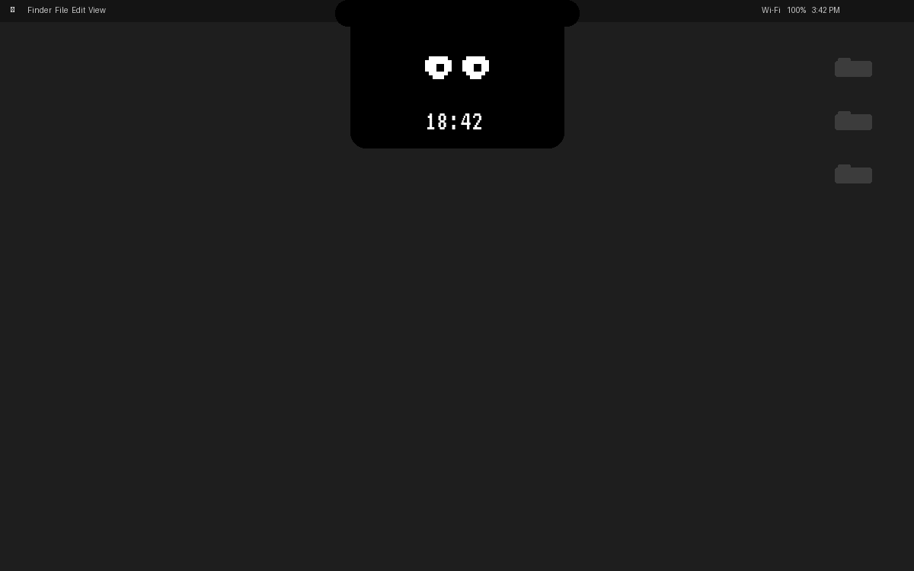
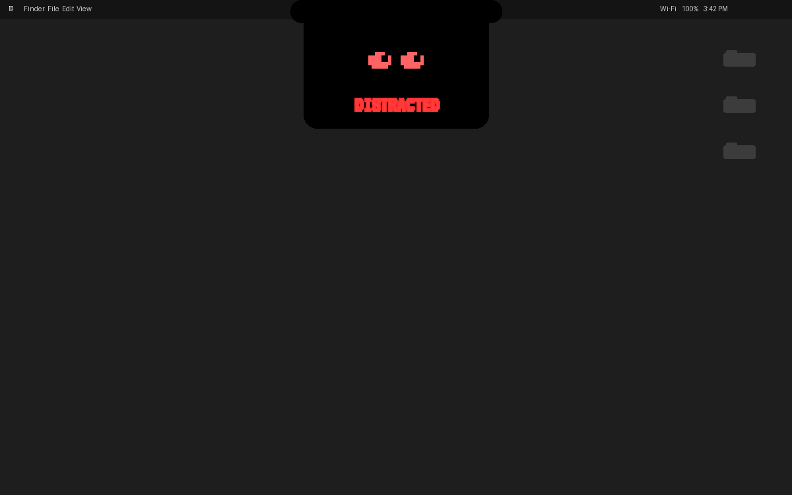
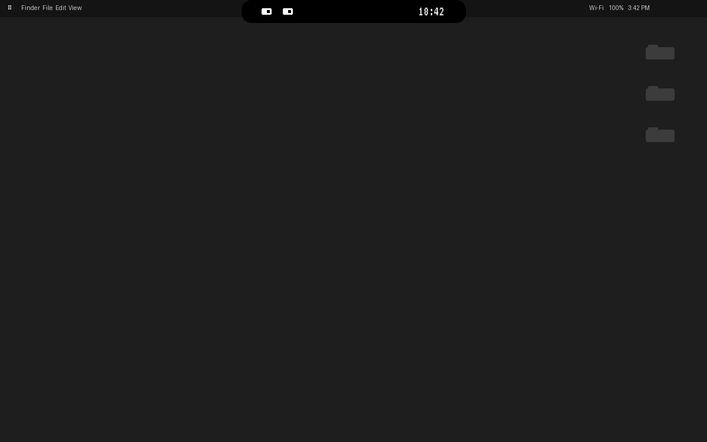

# LOLI

A focus companion that lives in your MacBook notch. Pixel-art robot eyes watch you through the camera — stay focused and they're happy, look away and they get angry.



## How it works

1. **Pick a duration** (or go free mode) and hit start
2. **Stay focused** — LOLI watches through your camera and reacts in real-time
3. **Look away** and the eyes get angry, the timer freezes, and "DISTRACTED" flashes red
4. **Stay distracted too long** and your timer resets completely

| Focused | Distracted |
|---------|-----------|
|  |  |

LOLI also collapses into a compact notch view with tiny eyes and timer:



## Features

- **Notch-native UI** — lives right in your MacBook notch using DynamicNotchKit
- **Camera-based focus detection** — no manual tracking, just look at your screen
- **Pixel-art robot eyes** — animated moods that react to your focus state
- **Countdown or stopwatch** — set 15/25/45/60 min or go open-ended
- **Sound effects** — retro chimes for focus gained, lost, timer complete
- **Distraction escalation** — warning → angry → timer reset
- **Auto-updates** via Sparkle
- **Privacy-first analytics** via TelemetryDeck (anonymous signals only)

## Install

Download the latest `.dmg` from [Releases](https://github.com/suraj-xd/loli-mac-app/releases/latest), open it, and drag LOLI to Applications.

Requires **macOS 14.0+** and a MacBook with a notch.

## Build from source

```bash
# Install xcodegen if you don't have it
brew install xcodegen

# Generate the Xcode project
xcodegen generate

# Build
xcodebuild -scheme LOLI -configuration Release build
```

## Web version

Don't have a Mac? Try the [web version](https://loli-eight.vercel.app) — same robot eyes, runs in your browser.

## License

MIT
